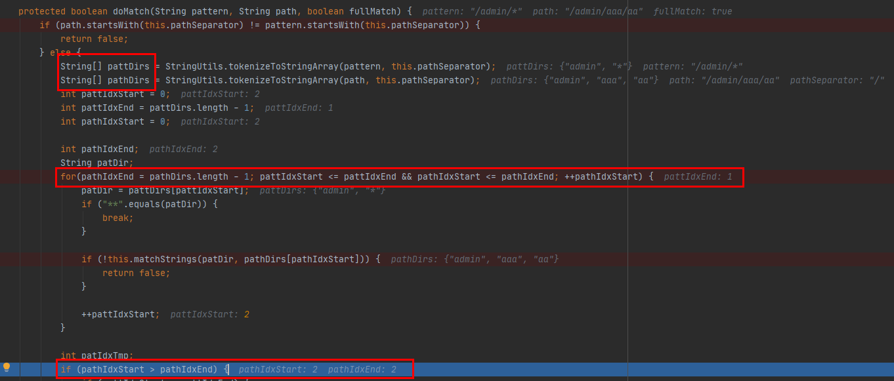
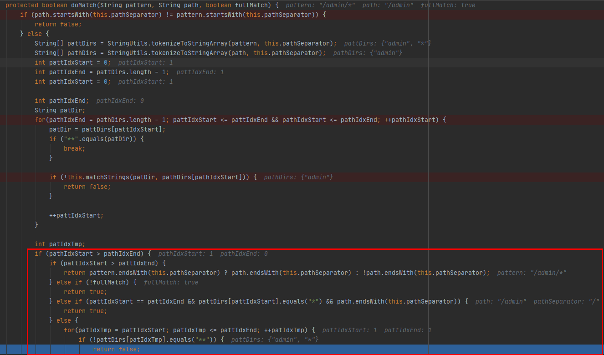
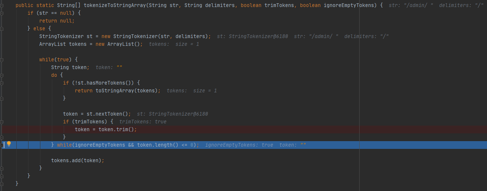
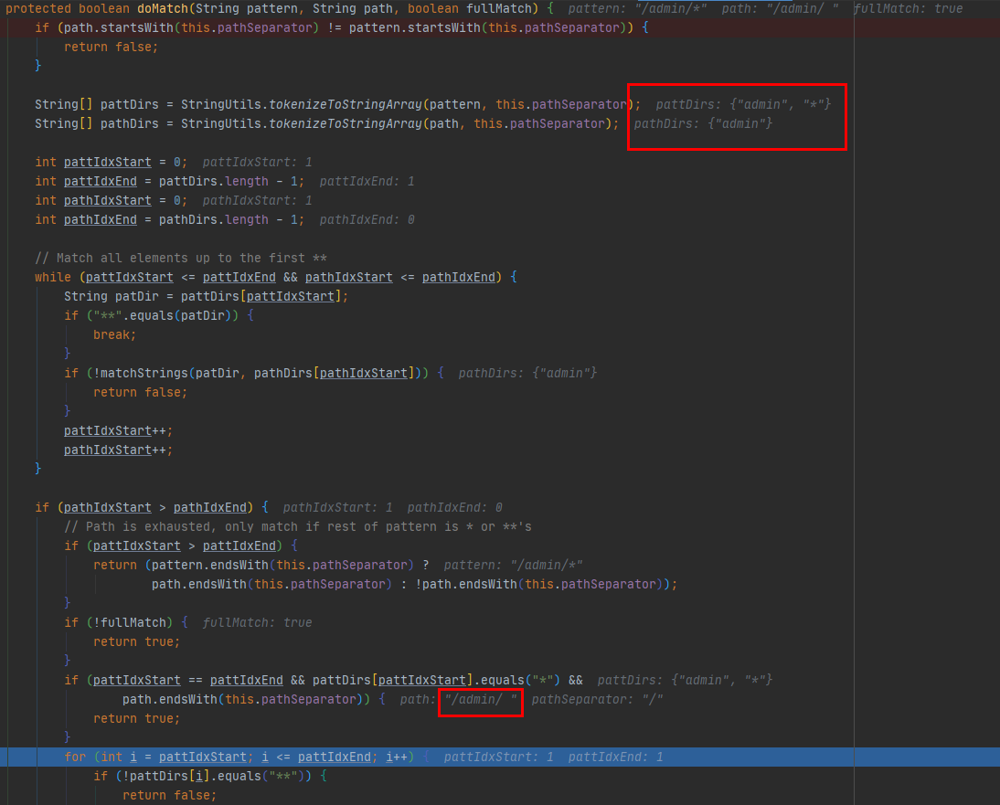
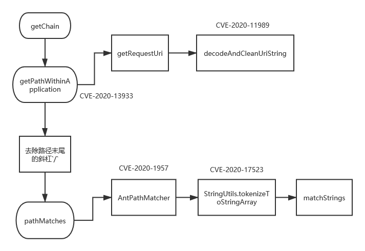

# Apache Shiro身份验证绕过漏洞分析合集

## CVE-2020-1957

### 靶场搭建

https://github.com/jweny/shiro-cve-2020-17523

### 受影响的版本

- Apache Shiro <= 1.4.2

### 漏洞分析

#### Shiro拦截器

参考：https://www.cnblogs.com/XueTing/p/13734792.html

这里用到的两种拦截器：

1. anon为匿名拦截器，不需要登录就能访问，一般用于静态资源,或者移动端接口
2. authc为登录拦截器，需要登录认证才能访问的资源。

举个常见的例子

```java
// 指所有路径都需要登陆才能访问
map.put("/*", "authc");

// 指doLogin任何人都可以访问
map.put("/doLogin", "anon");

```

结果就是，除了doLogin，其他路径都需要登陆才能访问。

Shiro使用Ant风格的路径匹配规则：

`*`  匹配0或者任意数量的字符

`**`  匹配0或者更多的目录

但在AntPathMatcher中，进入matchStrings前会去掉路径分隔符，再载入正则匹配，也就是说 /* 并不会匹配`/`字符

#### 漏洞成因

当用户传入/admin时，Shiro能正确拦截到路径；当用户传入/admin/时，由于Ant风格的路径匹配，Shiro无法匹配到admin/，从而导致权限控制被绕过。

当Shiro开始处理请求路径时，会调用Ant风格的路径匹配

```java
//org.apache.shiro.web.filter.mgt.PathMatchingFilterChainResolver

protected boolean pathMatches(String pattern, String path) {
    PatternMatcher pathMatcher = getPathMatcher();
    //此处pathMatcher = AntPathMatcher
    return pathMatcher.matches(pattern, path);  
}
```

进入AntPathMatcher，一路到DoMatch

```java
//org.apache.shiro.util.AntPathMatcher#doMatch

//假如传入的pattern = /*，path = /admin/
protected boolean doMatch(String pattern, String path, boolean fullMatch) {
    if (path.startsWith(this.pathSeparator) != pattern.startsWith(this.pathSeparator)) {
        return false;
    }

    String[] pattDirs = StringUtils.tokenizeToStringArray(pattern, this.pathSeparator);
    String[] pathDirs = StringUtils.tokenizeToStringArray(path, this.pathSeparator);

    int pattIdxStart = 0;
    int pattIdxEnd = pattDirs.length - 1;
    int pathIdxStart = 0;
    int pathIdxEnd = pathDirs.length - 1;

    while (pattIdxStart <= pattIdxEnd && pathIdxStart <= pathIdxEnd) {
        String patDir = pattDirs[pattIdxStart];
        if ("**".equals(patDir)) {
            break;
        }
        //matchStrings() 通过正则*匹配字符串admin，返回结果为true
        if (!matchStrings(patDir, pathDirs[pathIdxStart])) {
            return false;
        }
        pattIdxStart++;
        pathIdxStart++;
    }

    if (pathIdxStart > pathIdxEnd) {

    if (pattIdxStart > pattIdxEnd) {
      //正则为/*，因此返回结果取!path.endsWith(this.pathSeparator))的值，/admin/以路径分隔符结尾，故doMatch返回false
        return (pattern.endsWith(this.pathSeparator) ?
                path.endsWith(this.pathSeparator) : !path.endsWith(this.pathSeparator));
    }
```

由于DoMatch返回false，最终Shiro认为传入的路径不在权限控制范围内，因此放行。

### 漏洞修复

https://github.com/apache/shiro/pull/127/files

在pathsMatch中，加入了对路径结尾是否是`/`的判断，如果是，则去除掉`/`。

### 漏洞利用


## CVE-2020-11989(腾讯安全玄武实验室版) 

### 受影响的版本

- Apache Shiro 1.5.2

### 漏洞分析

Shiro对传入的路径处理流程如下：

```java
//org.apache.shiro.web.util.WebUtils

public static String getRequestUri(HttpServletRequest request) {
    String uri = (String)request.getAttribute("javax.servlet.include.request_uri");
    if (uri == null) {
        uri = request.getRequestURI();
    }

    return normalize(decodeAndCleanUriString(request, uri));
}
```

在decodeAndCleanUriString()中，进行了一次url解码

```java
//org.apache.shiro.web.util.WebUtils

private static String decodeAndCleanUriString(HttpServletRequest request, String uri) {
    uri = decodeRequestString(request, uri);
    int semicolonIndex = uri.indexOf(59);
    return semicolonIndex != -1 ? uri.substring(0, semicolonIndex) : uri;
}
```

之后进入AntPathMatcher



由于传入的正则和路径长度不同，路径没有全部匹配完便结束了for循环，此时不满足条件`pathIdxStart > pathIdxEnd`，导致匹配失败，认证被绕过。

```java

if (pathIdxStart > pathIdxEnd) {
    ...
    ...
} else if (pattIdxStart > pattIdxEnd) {
    return false;
```


### 漏洞修复


采用了标准的getServletPath(request) + getPathInfo(request)同时不再进行url解码。


### 漏洞利用


## CVE-2020-11989(l3yx版) 

### 受影响的版本

- Apache Shiro 1.5.2(需context-path不为web根目录)

- Apache Shiro < 1.5.2

### 漏洞分析

1.5.1版本中，Shiro对传入的路径处理流程如下：

```java
//org.apache.shiro.web.util.WebUtils

public static String getRequestUri(HttpServletRequest request) {
    String uri = (String)request.getAttribute("javax.servlet.include.request_uri");
    if (uri == null) {
        uri = request.getRequestURI();
    }

    return normalize(decodeAndCleanUriString(request, uri));
}
```

在decodeAndCleanUriString()中，进行了一次额外的url解码，并在路径中查找`;`号，截取分号前的部分

```java
//org.apache.shiro.web.util.WebUtils

private static String decodeAndCleanUriString(HttpServletRequest request, String uri) {
    uri = decodeRequestString(request, uri);
    int semicolonIndex = uri.indexOf(59);
    return semicolonIndex != -1 ? uri.substring(0, semicolonIndex) : uri;
}
```

假如用户传入`/;/admin/hello`，就会被截断为`/`。


从而绕过后续的一些判断。


### 漏洞修复


采用了标准的getServletPath(request) + getPathInfo(request)同时不再进行url解码。


### 漏洞利用


## CVE-2020-13933

### 受影响的版本

- Apache Shiro < 1.6.0

### 漏洞分析

下面看1.5.3版本的代码

```java
//org.apache.shiro.web.filter.mgt.PathMatchingFilterChainResolver

public FilterChain getChain(ServletRequest request, ServletResponse response, FilterChain originalChain) {
    FilterChainManager filterChainManager = this.getFilterChainManager();
    if (!filterChainManager.hasChains()) {
        return null;
    } else {
        String requestURI = this.getPathWithinApplication(request);
        if (requestURI != null && !"/".equals(requestURI) && requestURI.endsWith("/")) {
            requestURI = requestURI.substring(0, requestURI.length() - 1);
        }
```

直接看requestURI的获取过程，跟入getPathWithinApplication

```java
//org.apache.shiro.web.util.WebUtils

public static String getPathWithinApplication(HttpServletRequest request) {
    return normalize(removeSemicolon(getServletPath(request) + getPathInfo(request)));
}
```

在这里通过removeSemicolon对获取的路径进行一个简单的处理，从函数名字来看是做了个去除分号的操作。

```java
private static String removeSemicolon(String uri) {
    int semicolonIndex = uri.indexOf(59);
    return semicolonIndex != -1 ? uri.substring(0, semicolonIndex) : uri;
}
```

跟进去一看，确实是截取掉分号后的内容。

```java
//org.apache.shiro.web.filter.mgt.PathMatchingFilterChainResolver

public FilterChain getChain(ServletRequest request, ServletResponse response, FilterChain originalChain) {
    FilterChainManager filterChainManager = this.getFilterChainManager();
    if (!filterChainManager.hasChains()) {
        return null;
    } else {
        String requestURI = this.getPathWithinApplication(request);
        if (requestURI != null && !"/".equals(requestURI) && requestURI.endsWith("/")) {
            requestURI = requestURI.substring(0, requestURI.length() - 1);
        }
```

回到getChain，下一步则是去除掉路径后面的路径分隔符`/`。
也就是说，如果传入`/admin/;`，经过上述处理，就会变成`/admin`

进入AntPathMatcher的DoMatch方法进行路径匹配



传入`pattern = /admin/*`，`path = /admin`，第一轮for循环匹配admin和admin，肯定是没问题的，路径匹配完跳出循环，进入判断

```java
if (pathIdxStart > pathIdxEnd) {
     //此时正则部分还没完全匹配结束
    if (pattIdxStart > pattIdxEnd) {
        return pattern.endsWith(this.pathSeparator) ? path.endsWith(this.pathSeparator) : !path.endsWith(this.pathSeparator);
        //fullMatch默认为true
    } else if (!fullMatch) {
        return true;
        //传入的path为/admin，不以路径分隔符结尾
    } else if (pattIdxStart == pattIdxEnd && pattDirs[pattIdxStart].equals("*") && path.endsWith(this.pathSeparator)) {
        return true;
    } else {
        for(patIdxTmp = pattIdxStart; patIdxTmp <= pattIdxEnd; ++patIdxTmp) {
          //显然，传入的正则里不存在**
            if (!pattDirs[patIdxTmp].equals("**")) {
                return false;
            }
```

判断走到这里，返回false，匹配失败，从而绕过权限控制。

### 漏洞修复

添加一个InvalidRequestFilter类，对分号，反斜杠和非ASCII字符进行了过滤

```java
public class InvalidRequestFilter extends AccessControlFilter {
    private static final List<String> SEMICOLON = Collections.unmodifiableList(Arrays.asList(";", "%3b", "%3B"));
    private static final List<String> BACKSLASH = Collections.unmodifiableList(Arrays.asList("\\", "%5c", "%5C"));
    private boolean blockSemicolon = true;
    private boolean blockBackslash = !Boolean.getBoolean("org.apache.shiro.web.ALLOW_BACKSLASH");
    private boolean blockNonAscii = true;

    public InvalidRequestFilter() {
    }

    protected boolean isAccessAllowed(ServletRequest req, ServletResponse response, Object mappedValue) throws Exception {
        HttpServletRequest request = WebUtils.toHttp(req);
        return this.isValid(request.getRequestURI()) && this.isValid(request.getServletPath()) && this.isValid(request.getPathInfo());
    }
```

### 漏洞利用


## CVE-2020-17523

### 受影响的版本

- Apache Shiro < 1.7.1

### 漏洞分析

依然是AntPathMatcher的doMatch方法



通过StringUtils.tokenizeToStringArray获取pathDirs时，由于StringUtils.tokenizeToStringArray默认去除空格，导致当传入`/admin/%20`时，第二层路径唯一的字符空格被去掉，此时代码认为第二层路径不存在，最终返回了一个长度为1的pathDirs，而路径控制的正则是`/admin/*`，返回了一个长度为2的pattDirs。



显然while循环部分匹配了第一层路径就会结束，进入下面的判断流程。
从上图可以看到，在下面的判断流程中，匹配的对象是path，而path是`/admin/%20`，通过了路径结尾不是`/`的判断及其他判断。最终doMatch返回了fasle。

### 漏洞修复

https://github.com/apache/shiro/commit/0842c27fa72d0da5de0c5723a66d402fe20903df

原本调用StringUtils.tokenizeToStringArray时，trimTokens默认是true，因此会去掉空格。

```java
public static String[] tokenizeToStringArray(String str, String delimiters) {
    return tokenizeToStringArray(str, delimiters, true, true);
}
```

修复后直接设trimTokens的值为false，不再忽略空格了。

```java
String[] pattDirs = StringUtils.tokenizeToStringArray(pattern, this.pathSeparator, false, true);
```

同时调整了pathsMatch的逻辑。以前是先去除路径分隔符，再进行路径匹配。现在是先进行路径匹配，再去除路径分隔符。个人认为是为了修复特定情况下，通过`/admin/`直接可以绕过权限控制的问题。

如控制器里这样写的情况
```java
@GetMapping("/admin/*")
public String admin() {
    return "admin page";
}
```

### 漏洞利用


## 流程图

