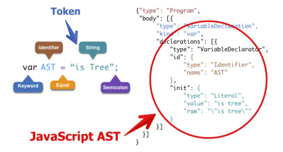
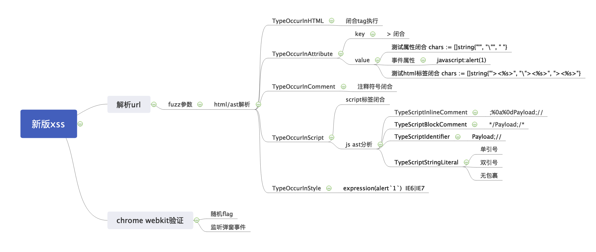
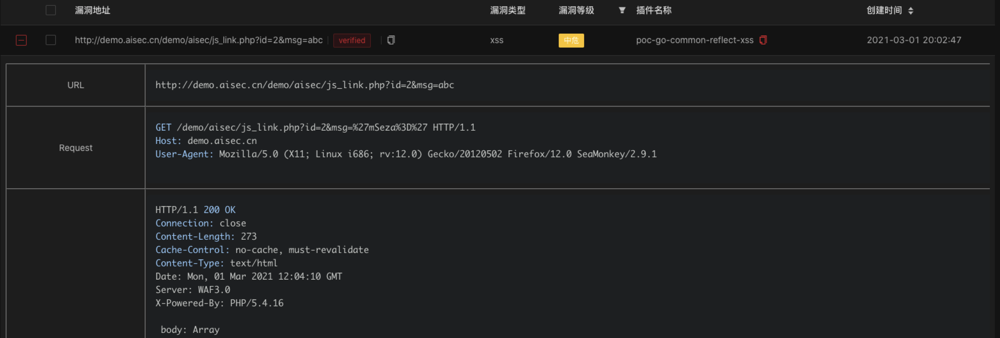

# 基于语义分析的XSS检测

## 常规XSS检测 VS AST检测

常规xss检测会对输入点进行fuzz,发送各种payload，还会存在大量误报的可能。
然而使用AST语义分析来做xss检测，可以精准的有目的的发送payload，根据判断输出点的位置进行发送特定payload。

## 什么是AST

> 抽象语法树（abstract syntax tree 或者缩写为 AST），或者语法树（syntax tree），是源代码的抽象语法结构的树状表现形式，这里特指编程语言的源代码。和抽象语法树相对的是具体语法树（concrete syntaxtree），通常称作分析树（parse tree）。一般的，在源代码的翻译和编译过程中，语法分析器创建出分析树。一旦 AST 被创建出来，在后续的处理过程中，比如语义分析阶段，会添加一些信息。
  

举个例子
```javascript
var AST = "is Tree"
```

AST结果 在线AST转换器 https://astexplorer.net/

```json
{
  "type": "Program",
  "body": [
    {
      "type": "VariableDeclaration",
      "declarations": [
        {
          "type": "VariableDeclarator",
          "id": {
            "type": "Identifier",
            "name": "AST",
            "range": [
              4,
              7
            ]
          },
          "init": {
            "type": "Literal",
            "value": "is Tree",
            "raw": "\"is Tree\"",
            "range": [
              10,
              19
            ]
          },
          "range": [
            4,
            19
          ]
        }
      ],
      "kind": "var",
      "range": [
        0,
        19
      ]
    }
  ],
  "sourceType": "module",
  "range": [
    0,
    19
  ]
}
```

生成抽象语法树需要经过两个阶段：
- 分词 （tokenize） 将整个代码字符串分割成最小语法单元数组
- 语义分析 (parse） 在分词基础上建立分析语法单元之间的关系





## JS AST with Golang 

PSF目前采用了 https://github.com/robertkrimen/otto 来做JS AST分析

具体的Ast Expression可查看代码
ast/node.go
```go
	ArrayLiteral struct {
		LeftBracket  file.Idx
		RightBracket file.Idx
		Value        []Expression
	}

	AssignExpression struct {
		Operator token.Token
		Left     Expression
		Right    Expression
	}

	BadExpression struct {
		From file.Idx
		To   file.Idx
	}

	BinaryExpression struct {
		Operator   token.Token
		Left       Expression
		Right      Expression
		Comparison bool
	}

	BooleanLiteral struct {
		Idx     file.Idx
		Literal string
		Value   bool
	}

	BracketExpression struct {
		Left         Expression
		Member       Expression
		LeftBracket  file.Idx
		RightBracket file.Idx
	}

	CallExpression struct {
		Callee           Expression
		LeftParenthesis  file.Idx
		ArgumentList     []Expression
		RightParenthesis file.Idx
	}

	ConditionalExpression struct {
		Test       Expression
		Consequent Expression
		Alternate  Expression
	}

	DotExpression struct {
		Left       Expression
		Identifier *Identifier
	}

	EmptyExpression struct {
		Begin file.Idx
		End   file.Idx
	}

	FunctionLiteral struct {
		Function      file.Idx
		Name          *Identifier
		ParameterList *ParameterList
		Body          Statement
		Source        string

		DeclarationList []Declaration
	}

	Identifier struct {
		Name string
		Idx  file.Idx
	}

	NewExpression struct {
		New              file.Idx
		Callee           Expression
		LeftParenthesis  file.Idx
		ArgumentList     []Expression
		RightParenthesis file.Idx
	}

	NullLiteral struct {
		Idx     file.Idx
		Literal string
	}

	NumberLiteral struct {
		Idx     file.Idx
		Literal string
		Value   interface{}
	}

	ObjectLiteral struct {
		LeftBrace  file.Idx
		RightBrace file.Idx
		Value      []Property
	}

	ParameterList struct {
		Opening file.Idx
		List    []*Identifier
		Closing file.Idx
	}

	Property struct {
		Key   string
		Kind  string
		Value Expression
	}

	RegExpLiteral struct {
		Idx     file.Idx
		Literal string
		Pattern string
		Flags   string
		Value   string
	}

	SequenceExpression struct {
		Sequence []Expression
	}

	StringLiteral struct {
		Idx     file.Idx
		Literal string
		Value   string
	}

	ThisExpression struct {
		Idx file.Idx
	}

	UnaryExpression struct {
		Operator token.Token
		Idx      file.Idx // If a prefix operation
		Operand  Expression
		Postfix  bool
	}

	VariableExpression struct {
		Name        string
		Idx         file.Idx
		Initializer Expression
	}
```

otto解析`var a=1;`结果


对于反射xss的分析，需要用到的有
- StringLiteral
- Identifier


## XSS输入点


总体分类来讲，可以分成
- 在html中
- 在属性中
- 在注释中
- 在script中
- 在css/sytle特殊处理




接下来我们就需要编写一个函数来判断在输入点的位置

使用 https://pkg.go.dev/golang.org/x/net/html 模块来处理html

> Given a Tokenizer z, the HTML is tokenized by repeatedly calling z.Next(), which parses the next token and returns its type, or an error:
  
```go
z := html.NewTokenizer(r)
for {
	tt := z.Next()
	if tt == html.ErrorToken {
		// ...
		return ...
	}
	// Process the current token.
}
```
根据文档内容，我们可以来对html进行处理,获取`tagname`、`content`、`attributes`

```go
for {
		tt := z.Next()

		switch tt {

		case html.ErrorToken:
			break processing

		case html.TextToken:
			parser.handleText(z)

		case html.StartTagToken:
			parser.handleStartTag(z)

		case html.EndTagToken:
			parser.handleEndTag()

		case html.SelfClosingTagToken:
			parser.handleStartTag(z)
			parser.handleEndTag()

		case html.CommentToken:
			parser.handleComment(z)
		}
	}
```

判断输入点
```go
occurrences := xss.SearchInputInResponse(xssChecker, newBody)
if len(occurrences) == 0 {
    payloads = append(payloads, xss.checkWhenNoOccur(link, testParams, k)...)
}

for _, occur := range occurrences {
    switch occur.Type {
    case TypeOccurInHTML:
        payloads = append(payloads, xss.checkOccurInHTML(link, occur, testParams, k)...)
    case TypeOccurInAttribute:
        payloads = append(payloads, xss.checkOccurInAttributes(link, occur, testParams, k)...)
    case TypeOccurInComment:
        payloads = append(payloads, xss.checkOccurInAComment(link, testParams, k)...)
    case TypeOccurInScript:
        payloads = append(payloads, xss.checkOccurInScript(link, occur, testParams, k)...)
    }
}
```


以TypeOccurInHTML类型举例子
```html
<html>
<body>
<textarea>
<div>

</div>
</textarea>
</body>
</html>
```
判断是否成功闭合逃逸标签/符号
```go
flag := RandomString(6) //tlZktl
payload := fmt.Sprintf("</%s><%s>", randomUpper(occur.Tokenizer.TagName), flag) // </TexTareA><tlZktl>
testParams[field] = payload

occurs, verify, err := xss.check(link, testParams, flag)
if err != nil {
    log.Error(err)
    return payloads
}

for _, o := range occurs {
    if o.Tokenizer.TagName == strings.ToLower(flag) {
        // html标签可被闭合
        payloads = append(payloads, xss.makeResult(field, fmt.Sprintf("</%s><svg onload=alert`%s`>", randomUpper(occur.Tokenizer.TagName), flag), link.URL, link.Data, flag, verify))
        break
    }
}
```

当传入`</TexTareA><tlZktl>`如果闭合标签成功，那么`tagname`就等于`flag`,此时判断逃逸成功。


对于`TypeOccurInScript`的情况，就需要用到AST对js进行解析，来判断是否成功。

- `TypeScriptBlockComment`、`TypeScriptInlineComment`
```go
func (p *JSParser) getComments(source string, program *ast.Program) {
	comments := program.Comments
	for _, v := range comments {
		s := strings.TrimSpace(source[v[0].Begin:])
		commentFlag := s[0:2]
		switch commentFlag {
		case FlagBlockComment:
			t := &tokenizer{
				Type:    TypeScriptBlockComment,
				Content: []byte(v[0].Text),
				Index:   int(v[0].Begin),
			}
			p.tokenizers = append(p.tokenizers, t)
		case FlagInlineComment:
			t := &tokenizer{
				Type:    TypeScriptInlineComment,
				Content: []byte(v[0].Text),
				Index:   int(v[0].Begin),
			}
			p.tokenizers = append(p.tokenizers, t)
		}
	}
}
```

- `TypeScriptIdentifier`、`TypeScriptStringLiteral`
```go
func (p *JSParser) Enter(n ast.Node) ast.Visitor {
	if id, ok := n.(*ast.Identifier); ok && id != nil {
		t := &tokenizer{
			Type:    TypeScriptIdentifier,
			Index:   int(n.Idx0()),
			Content: []byte(id.Name),
		}
		p.tokenizers = append(p.tokenizers, t)
	}
	if v, ok := n.(*ast.VariableExpression); ok && v != nil {
		t := &tokenizer{
			Type:  TypeScriptVariableExpression,
			Index: int(n.Idx0()),
		}
		p.tokenizers = append(p.tokenizers, t)
	}
	if s, ok := n.(*ast.StringLiteral); ok && s != nil {
		t := &tokenizer{
			Type:    TypeScriptStringLiteral,
			Content: []byte(s.Literal),
			Index:   int(n.Idx0()),
		}
		p.tokenizers = append(p.tokenizers, t)
	}

	return p
}
```
通过解析js返回的类型来判断进入相应的处理流程进行payload测试。
最终的flag的`type==TypeScriptIdentifier` 说明成功逃逸，可以执行。

例子：

假设`Hello, World.`是可控制点
```js
<script>
console.log("Hello, World.");
</script>
```

第一个数据包会测试flag的位置`console.log("flag")`

AST会解析`flag`是`TypeScriptStringLiteral`类型，发送payload,`"-dkVqDH-"` , 当 `dkVqDH` AST解析为`TypeScriptIdentifier` 那说明逃逸成功。


补充一点，对于特殊的属性进行特殊处理

```go
var EvalAttitudes = [...]string{"onbeforeonload", "onsubmit", "ondragdrop", "oncommand", "onbeforeeditfocus", "onkeypress",
	"onoverflow", "ontimeupdate", "onreset", "ondragstart", "onpagehide", "onunhandledrejection",
	"oncopy",
	"onwaiting", "onselectstart", "onplay", "onpageshow", "ontoggle", "oncontextmenu", "oncanplay",
	"onbeforepaste", "ongesturestart", "onafterupdate", "onsearch", "onseeking",
	"onanimationiteration",
	"onbroadcast", "oncellchange", "onoffline", "ondraggesture", "onbeforeprint", "onactivate",
	"onbeforedeactivate", "onhelp", "ondrop", "onrowenter", "onpointercancel", "onabort",
	"onmouseup",
	"onbeforeupdate", "onchange", "ondatasetcomplete", "onanimationend", "onpointerdown",
	"onlostpointercapture", "onanimationcancel", "onreadystatechange", "ontouchleave",
	"onloadstart",
	"ondrag", "ontransitioncancel", "ondragleave", "onbeforecut", "onpopuphiding", "onprogress",
	"ongotpointercapture", "onfocusout", "ontouchend", "onresize", "ononline", "onclick",
	"ondataavailable", "onformchange", "onredo", "ondragend", "onfocusin", "onundo", "onrowexit",
	"onstalled", "oninput", "onmousewheel", "onforminput", "onselect", "onpointerleave", "onstop",
	"ontouchenter", "onsuspend", "onoverflowchanged", "onunload", "onmouseleave",
	"onanimationstart",
	"onstorage", "onpopstate", "onmouseout", "ontransitionrun", "onauxclick", "onpointerenter",
	"onkeydown", "onseeked", "onemptied", "onpointerup", "onpaste", "ongestureend", "oninvalid",
	"ondragenter", "onfinish", "oncut", "onhashchange", "ontouchcancel", "onbeforeactivate",
	"onafterprint", "oncanplaythrough", "onhaschange", "onscroll", "onended", "onloadedmetadata",
	"ontouchmove", "onmouseover", "onbeforeunload", "onloadend", "ondragover", "onkeyup",
	"onmessage",
	"onpopuphidden", "onbeforecopy", "onclose", "onvolumechange", "onpropertychange", "ondblclick",
	"onmousedown", "onrowinserted", "onpopupshowing", "oncommandupdate", "onerrorupdate",
	"onpopupshown",
	"ondurationchange", "onbounce", "onerror", "onend", "onblur", "onfilterchange", "onload",
	"onstart",
	"onunderflow", "ondragexit", "ontransitionend", "ondeactivate", "ontouchstart", "onpointerout",
	"onpointermove", "onwheel", "onpointerover", "onloadeddata", "onpause", "onrepeat",
	"onmouseenter",
	"ondatasetchanged", "onbegin", "onmousemove", "onratechange", "ongesturechange",
	"onlosecapture",
	"onplaying", "onfocus", "onrowsdelete"}
```

## chrome webkit验证
检测的时候尽量避免发送敏感关键字，所以是否真的能够执行需要使用webkit来对弹窗事件进行监听。

监听弹窗事件

```go
chromedp.ListenTarget(ctx, func(ev interface{}) {
		if ev, ok := ev.(*page.EventJavascriptDialogOpening); ok {
			log.Debugf("closing alert: %s", ev.Message)
			//  判断message 是否跟传入payload相同
			if flag == "" || flag == ev.Message {
				result = true
			}
			go func() {
				if err := chromedp.Run(ctx,
					page.HandleJavaScriptDialog(true),
				); err != nil {
					panic(err)
				}
			}()
		}
	})
```

### 问题1：
golang的chromedp没有现成的post发送数据包
### 解决方案
使用`chromedp.EvaluateAsDevTools`来执行document.write来写入html来进行post发送数据包。

**这里有个细节需要注意**，由于带xss payload，会直接在写入的form表单里直接执行了xss代码从而导致误报。

这里使用Textarea来解决页面直接执行xss的问题。
代码
```go
submitButton := `document.write("<form action='%s' method='POST' id='xss_form'>%s<input type='submit' value='Submit'></form> ")`
	var postMap map[string]string
	var postString []string
	var input string

	postString = strings.Split(args.Data, "&")
	postMap = make(map[string]string)
	for _, pair := range postString {
		z := strings.Split(pair, "=")
		if len(z) == 2 {
			postMap[z[0]] = z[1]
		} else {
			postMap[z[0]] = ""
		}
		if z[0] == param {
			postMap[z[0]] = payload
		}
	}
	for k, v := range postMap {
		input += fmt.Sprintf("<textarea name='%s' form='xss_form'>%s</textarea>", k, v)
	}
	submitButton = fmt.Sprintf(submitButton, args.URL, input)
```

### TODO LIST
还存在不足的地方
- dom xss后续的支持
- waf bypass

## PSF扫描案例

